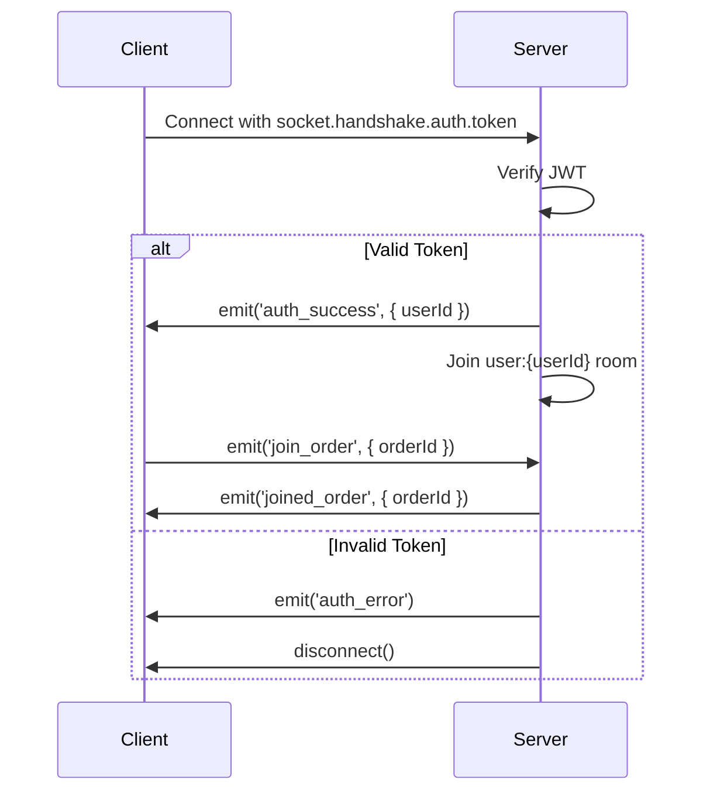
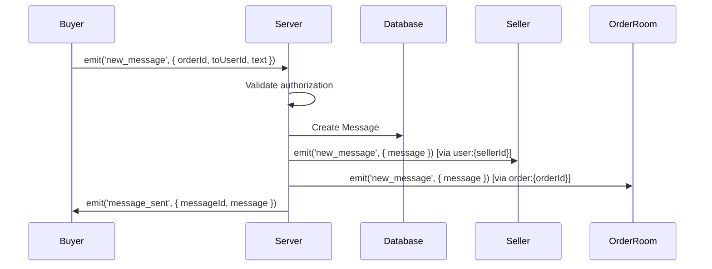

# Socket.io Event Contract

This document defines all Socket.io events used in the Tigray Marketplace application.

## Connection & Authentication

### Client → Server

#### `auth` (during connection)
**When**: Sent automatically during initial connection via `socket.handshake.auth.token`

**Payload**:
```typescript
{
  token: string; // JWT token
}
```

**Response Events**: 
- `auth_success` if valid
- `auth_error` if invalid

### Server → Client

#### `auth_success`
**When**: After successful JWT verification

**Payload**:
```typescript
{
  userId: string;
}
```

#### `auth_error`
**When**: JWT verification fails

**Payload**:
```typescript
{
  message: string;
}
```

---

## Room Management

### Client → Server

#### `join_order`
**When**: User wants to receive updates for a specific order

**Payload**:
```typescript
{
  orderId: string;
}
```

**Authorization**: User must be buyer, seller, or admin of the order

**Response**:
- `joined_order` on success
- `error` if not authorized

### Server → Client

#### `joined_order`
**When**: Successfully joined order room

**Payload**:
```typescript
{
  orderId: string;
}
```

---

## Order Operations

### Client → Server

#### `create_order_intent`
**When**: Buyer creates a new order intent

**Payload**:
```typescript
{
  listingId: string;
  meeting_info?: {
    date?: string; // ISO date
    place?: string;
    notes?: string;
  };
  selected_payment_method: string;
  buyer_note?: string;
}
```

**Authorization**: Authenticated user

**Side Effects**:
- Creates Order document in database
- Emits `order_update` to seller
- Emits `notification` to seller

### Server → Client

#### `order_created`
**When**: Order intent created successfully

**Payload**:
```typescript
{
  orderId: string;
  order: Order; // Full order object
}
```

**Delivered To**: Order creator (buyer)

#### `order_update`
**When**: Order status or payment status changes

**Payload**:
```typescript
{
  orderId: string;
  status: OrderStatus;
  payment_status?: PaymentStatus;
  message?: string;
}
```

**Delivered To**: All users in `order:{orderId}` room (buyer, seller, admins)

#### `notification`
**When**: General notification for user

**Payload**:
```typescript
{
  type: 'new_order' | 'order_status_changed' | 'new_message' | 'invoice_ready' | 'dispute_filed';
  payload: {
    orderId?: string;
    listingTitle?: string;
    buyerName?: string;
    status?: string;
    [key: string]: any;
  };
}
```

**Delivered To**: Specific user via `user:{userId}` room

---

## Order Status Updates

### Client → Server

#### `mark_order_status`
**When**: Seller or admin updates order status

**Payload**:
```typescript
{
  orderId: string;
  status: 'seller_confirmed' | 'awaiting_payment_confirmation' | 'paid_offsite' | 'shipped' | 'collected' | 'delivered' | 'cancelled';
  note?: string;
}
```

**Authorization**: Must be seller of order or admin

**Side Effects**:
- Updates Order document
- Updates statusHistory
- May update payment_status if status is 'paid_offsite'
- Emits `order_update` to order room
- Emits `notification` to buyer

---

## Messaging

### Client → Server

#### `new_message`
**When**: User sends a message in an order conversation

**Payload**:
```typescript
{
  orderId: string;
  toUserId: string;
  text: string;
  attachments?: Array<{
    url: string;
    type: 'image' | 'pdf' | 'file';
    name?: string;
    size?: number;
  }>;
}
```

**Authorization**: Must be buyer or seller of the order

**Side Effects**:
- Creates Message document
- Emits `new_message` to recipient
- Emits `new_message` to order room

### Server → Client

#### `new_message`
**When**: New message received in conversation

**Payload**:
```typescript
{
  message: {
    _id: string;
    orderId: string;
    senderId: {
      _id: string;
      name: string;
      email: string;
    };
    recipientId: string;
    text: string;
    attachments: Array<{
      url: string;
      type: string;
      name?: string;
    }>;
    isRead: boolean;
    deliveredAt: Date;
    createdAt: Date;
  };
}
```

**Delivered To**:
- Recipient via `user:{recipientId}` room
- All users in `order:{orderId}` room

#### `message_sent`
**When**: Confirmation that message was sent successfully

**Payload**:
```typescript
{
  messageId: string;
  message: Message;
}
```

**Delivered To**: Message sender

#### `message_read`
**When**: Recipient marks message as read

**Payload**:
```typescript
{
  messageId: string;
  readAt: Date;
}
```

**Delivered To**: Message sender

### Client → Server

#### `mark_message_read`
**When**: User marks a message as read

**Payload**:
```typescript
{
  messageId: string;
}
```

**Authorization**: Must be the recipient of the message

**Side Effects**:
- Updates Message.isRead and Message.readAt
- Emits `message_read` to sender

---

## Invoice Generation

### Client → Server

#### `generate_invoice`
**When**: Seller or admin requests invoice generation

**Payload**:
```typescript
{
  orderId: string;
}
```

**Authorization**: Must be seller of order or admin

**Side Effects**:
- Enqueues invoice generation job in Bull queue
- Emits `invoice_queued` to requester
- Eventually emits `invoice_ready` when PDF is generated

### Server → Client

#### `invoice_queued`
**When**: Invoice generation job added to queue

**Payload**:
```typescript
{
  orderId: string;
  jobId: string | number;
  message: string;
}
```

**Delivered To**: Invoice requester

#### `invoice_ready`
**When**: Invoice PDF generation completed

**Payload**:
```typescript
{
  invoiceId: string;
  orderId: string;
  pdfUrl: string;
}
```

**Delivered To**: Invoice requester via `user:{userId}` room

---

## Error Handling

### Server → Client

#### `error`
**When**: Any socket operation fails

**Payload**:
```typescript
{
  message: string;
  code?: string;
}
```

**Delivered To**: Specific user who triggered the error

---

## Connection Events

### Client → Server

#### `disconnect`
**When**: Client disconnects

**Reason**: Various (transport close, client disconnect, etc.)

No payload required.

### Server → Client

#### `disconnect`
**When**: Server disconnects client

**Reason**: String describing disconnection reason

---

## Room Naming Convention

- **User rooms**: `user:{userId}` - Individual user notifications
- **Order rooms**: `order:{orderId}` - Order-specific updates (buyer, seller, admins)

---

## TypeScript Type Definitions

```typescript
// Order Statuses
type OrderStatus = 
  | 'requested'
  | 'seller_confirmed'
  | 'awaiting_payment_confirmation'
  | 'paid_offsite'
  | 'shipped'
  | 'collected'
  | 'delivered'
  | 'cancelled'
  | 'disputed';

type PaymentStatus = 
  | 'none'
  | 'pending'
  | 'paid_offsite'
  | 'disputed';

// Notification Types
type NotificationType =
  | 'new_order'
  | 'order_status_changed'
  | 'new_message'
  | 'invoice_ready'
  | 'dispute_filed';

// Complete interfaces
interface CreateOrderIntentPayload {
  listingId: string;
  meeting_info?: {
    date?: string;
    place?: string;
    notes?: string;
  };
  selected_payment_method: string;
  buyer_note?: string;
}

interface NewMessagePayload {
  orderId: string;
  toUserId: string;
  text: string;
  attachments?: Array<{
    url: string;
    type: 'image' | 'pdf' | 'file';
    name?: string;
    size?: number;
  }>;
}

interface MarkOrderStatusPayload {
  orderId: string;
  status: OrderStatus;
  note?: string;
}

interface NotificationPayload {
  type: NotificationType;
  payload: Record<string, any>;
}
```

---

## Authentication Flow



---

## Message Flow



---

## Best Practices

1. **Always authenticate**: Check `socket.user` or `socket.userId` before processing events
2. **Join rooms**: Users must join relevant rooms to receive updates
3. **Error handling**: Emit `error` event with descriptive message on failures
4. **Validation**: Validate all payload data before processing
5. **Authorization**: Verify user permissions for each operation
6. **Logging**: Log all socket events for debugging
7. **Reconnection**: Client should implement exponential backoff for reconnections

---

## Testing Socket.io

### Manual Testing
Use a tool like Socket.io Client Test Tool or browser console:

```javascript
import io from 'socket.io-client';

const socket = io('http://localhost:3000', {
  auth: { token: 'YOUR_JWT_TOKEN' }
});

socket.on('auth_success', (data) => {
  console.log('Authenticated:', data);
  
  // Join an order room
  socket.emit('join_order', { orderId: 'ORDER_ID_HERE' });
});

socket.on('order_update', (data) => {
  console.log('Order updated:', data);
});
```

### Automated Testing
See `server/src/__tests__/socket.test.js` for examples.

---

## Troubleshooting

**Socket not connecting**:
- Check JWT token validity
- Verify `VITE_SOCKET_URL` matches backend URL
- Check CORS configuration

**Not receiving updates**:
- Ensure user joined relevant rooms
- Check server logs for event emissions
- Verify user authorization for the order/resource

**Messages not delivering**:
- Confirm both users are connected
- Check `toUserId` is correct
- Verify order authorization

---

For implementation details, see:
- Backend: `server/src/sockets/index.js`
- Frontend: `client/src/services/socket.js` and `client/src/hooks/useSocket.jsx`

